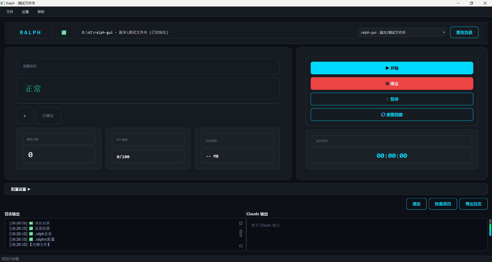

# Ralph GUI

> 本项目是 [Ralph for Claude Code](https://github.com/ Anthropic/claude-code) 的 Python + PySide6 重写版本，专为 Windows 桌面用户设计，**对中文用户友好**。

Windows 桌面应用程序，用于管理 Ralph for Claude Code 项目。采用 PySide6 (Qt) 构建，MVP 架构。

## 功能

- **图形化界面** - 选择项目目录，启动/停止/暂停循环
- **可视化断路器状态** - 实时显示回路断路器状态
- **实时日志输出** - 监控面板显示执行日志
- **项目设置管理** - 配置管理和初始化
- **会话管理** - 支持会话连续性和过期控制
- **速率限制** - 内置 API 调用管理，每小时限制和倒计时
- **智能退出检测** - 双重条件检查：完成指标 + 显式 EXIT_SIGNAL
- **PRD 导入** - 从外部源导入任务

## 技术栈

- Python 3.10+
- PySide6 >= 6.6.0 (Qt GUI)
- PyYAML >= 6.0
- PyInstaller (打包)

## 环境要求

### 运行时环境
- **操作系统**: Windows 10/11 (64-bit)
- **Python**: 3.10 或更高版本
- **内存**: 最低 4GB，推荐 8GB
- **磁盘空间**: 约 200MB

### 开发环境（可选）
- **Git**: 用于版本控制和项目初始化
- **VS Code** 或其他 Python IDE（推荐）

### Python 依赖

```
PySide6 >= 6.6.0       # Qt GUI 框架
PyYAML >= 6.0          # YAML 配置文件解析
pyinstaller >= 6.0      # 打包为可执行文件
pytest >= 8.0           # 单元测试（可选）
```

### Claude Code CLI

本应用需要预先安装 Claude Code CLI：
```bash
npm install -g @anthropic-ai/claude-code
```

## 安装

### 方式一：使用打包版本

1. 下载最新版本的 `RalphGUI.exe`
2. 双击运行

### 方式二：从源码构建

1. 确保已安装 Python 3.10+
2. 安装依赖：
   ```
   pip install -r requirements.txt
   ```
3. 运行应用：
   ```
   python src/ralph_gui/main.py
   ```

### 构建可执行文件

```
build.bat
```

## 快速开始

### 运行应用

```bash
python src/ralph_gui/main.py
```

### 测试

```bash
pytest                          # 运行所有测试
pytest tests/test_models/       # 运行特定目录测试
pytest tests/test_services/      # 运行服务测试
```

## 使用说明

### 界面布局

启动应用后，主界面包含以下区域：



### 基本操作

#### 1. 选择项目目录
1. 点击「选择目录」按钮
2. 在弹出的对话框中选择包含 `.ralphrc` 文件的项目文件夹
3. 如果项目未初始化，应用会提示进行初始化

#### 2. 启动循环
1. 确保已选择有效的项目目录
2. 点击「启动」按钮
3. 应用将开始调用 Claude Code CLI 并执行循环任务
4. 日志区域会实时显示执行日志

#### 3. 暂停/恢复循环
- 点击「暂停」可暂停当前循环
- 点击「恢复」可继续被暂停的循环

#### 4. 停止循环
- 点击「停止」可终止当前循环任务

### 设置面板

点击「设置」按钮可打开设置面板，包含以下选项：

| 设置项 | 说明 |
|--------|------|
| Claude Code 命令 | 指定 Claude Code CLI 的调用命令（默认: `claude`） |
| 最大调用次数/小时 | API 速率限制（默认: 100） |
| 超时时间 | 单次调用超时时间（默认: 15 分钟） |
| 断路器阈值 | 无进展/相同错误次数阈值 |
| 会话连续性 | 是否保持会话连续性 |

### 状态指示

#### 断路器状态
- **CLOSED**: 正常运行
- **HALF_OPEN**: 部分恢复，允许测试请求
- **OPEN**: 已触发保护，暂停调用

#### 循环状态
- **已停止**: 循环未运行
- **运行中**: 正在执行任务
- **已暂停**: 循环被用户暂停

### 常见问题

**Q: 启动时提示"找不到 Claude Code"**
> 确保已安装 Claude Code CLI：`npm install -g @anthropic-ai/claude-code`

**Q: 日志显示"断路器已打开"**
> 应用自动检测到连续失败或无进展，已暂停调用。按「恢复」可重置断路器。

**Q: 如何查看详细日志？**
> 点击「日志输出」区域，使用鼠标滚轮或滚动条查看完整日志。

## 架构

### 目录结构

```
src/ralph_gui/
├── main.py          # 应用入口
├── app.py           # RalphApp 应用类
├── main_window.py   # 主窗口 (View)
├── presenters/      # Presenter 层 - 业务逻辑
├── services/        # Service 层 - CLI、状态、配置、日志
├── models/          # Model 层 - 数据模型
├── views/           # View 层 - UI 组件
├── lib/             # lib 层 - Python 库模块
├── scripts/         # scripts 层 - Python 脚本
├── templates/       # 模板文件 (PROMPT.md, AGENT.md, fix_plan.md)
├── examples/        # 示例项目
└── i18n/           # 国际化
```

### MVP 架构

- **Views**: `main_window.py`, `views/` - UI 组件，PySide6 widgets
- **Presenters**: `presenters/` - 连接 View 与 Model，处理业务逻辑
- **Services**: `services/` - CLI 调用、状态管理、配置管理、日志
- **Models**: `models/` - 数据模型 (CircuitBreaker, LoopState, Project 等)

### 核心模型

- `CircuitBreakerModel` - 回路断路器状态 (CLOSED/HALF_OPEN/OPEN)
- `LoopStateModel` - 循环状态
- `Project` - 项目信息
- `RateLimitModel` - API 速率限制

### 关键服务

- `CLIService` - 纯 Python CLI 服务（不依赖外部脚本）
- `StateService` - 管理 Ralph 状态文件
- `ConfigService` - 管理 `.ralphrc` 配置
- `LogService` - 日志管理

## 配置

### 项目配置 (.ralphrc)

每个 Ralph 项目可以有 `.ralphrc` 配置文件：

```bash
# .ralphrc - Ralph 项目配置
PROJECT_NAME="my-project"
PROJECT_TYPE="typescript"

# Claude Code CLI 命令
CLAUDE_CODE_CMD="claude"

# 循环设置
MAX_CALLS_PER_HOUR=100
CLAUDE_TIMEOUT_MINUTES=15
CLAUDE_OUTPUT_FORMAT="json"

# 工具权限
ALLOWED_TOOLS="Write,Read,Edit,Bash(git *),Bash(npm *),Bash(pytest)"

# 会话管理
SESSION_CONTINUITY=true
SESSION_EXPIRY_HOURS=24

# 断路器阈值
CB_NO_PROGRESS_THRESHOLD=3
CB_SAME_ERROR_THRESHOLD=5
```

## 系统要求

- Windows 10/11
- Python 3.10+ (如从源码运行)
- Git (用于项目初始化)

## 许可证

本项目基于 MIT 许可证开源 - 详见 [LICENSE](LICENSE) 文件。
